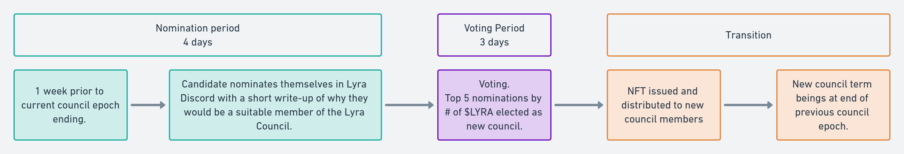

<!--You can leave these HTML comments in your merged LEAP and delete the visible duplicate text guides, they will not appear and may be helpful to refer to if you edit it again. This is the suggested template for new LEAPs. Note that a LEAP number will be assigned by an editor. When opening a p ull request to submit your LEAP, please use an abbreviated title in the filename, `leap-draft_title_abbrev.md`. The title should be 44 characters or less.-->

## Simple Summary
<!--"If you can't explain it simply, you don't understand it well enough." Simply describe the outcome the proposed changes intends to achieve. This should be non-technical and accessible to a casual community member.-->
This LEAP proposes V1 of Lyra's governance.

## Abstract
<!--A short (~200 word) description of the proposed change, the abstract should clearly describe the proposed change. This is what *will* be done if the LEAP is implemented, not *why* it should be done or *how* it will be done. If the LEAP proposes deploying a new contract, write, "we propose to deploy a new contract that will do x".-->
The essence of V1 governance is a five-seat representative council elected by the LYRA token holders. This group is known as the "Lyra Council" and has the mandate to administer the LEAP framework, which seeks to ensure that changes to the protocol are transparent and well-governed. The Lyra Council sits for three calendar months, after which a new Council is elected.

##  Motivation
<!--This is the problem statement. This is the *why* of the LEAP. It should clearly explain *why* the current state of the protocol is inadequate.  It is critical that you explain *why* the change is needed, if the LEAP proposes changing how something is calculated, you must address *why* the current calculation is innaccurate or wrong. This is not the place to describe how the LEAP will address the issue!-->
The Lyra Launch Council, established [here](https://blog.lyra.finance/introducing-the-lyra-launch-council/) and extended in [LEAP-10](https://leaps.lyra.finance/leaps/leap-10) is coming to a close. Having launched the LYRA token, it's now possible for token holders to elect the new council. In preparation, we would like to codify the processes that have been running informally since the inception of the Lyra Launch Council and define the election process.

Governance is crucial to get right and yet very complex. As such, we intend the evolution of Lyra's governance to be an iterative process, moving progressively toward more decentralisation. By enabling LYRA token holders to elect the Council, V1 provides a meaningful advance over the Lyra Launch Council.

## Specification

<!--The specification should describe the syntax and semantics of any new feature, there are five sections
1. Overview
2. Rationale
3. Technical Specification
4. Test Cases
5. Configurable Values
-->

### Overview
<!--This is a high level overview of *how* the LEAP will solve the problem. The overview should clearly describe how the new feature will be implemented.-->
Lyra will be governed by a five-seat representative council that is elected by LYRA token holders. The Lyra Council will administer the LEAP framework, which controls how the protocol changes and how community tokens are allocated.

### Rationale

The representative council model has worked well for Lyra so far, allowing the core team to iterate quickly whilst transitioning control to the community.

### Technical Specification

#### 1. LEAPS
A LEAP is a proposal to change part of the Lyra Protocol and can be created by anyone in the community. For a complete description of what a LEAP is, please see [LEAP-1](https://leaps.lyra.finance/leaps/leap-1/). Some examples include:
- Listing new markets ([LEAP-2](https://leaps.lyra.finance/leaps/leap-2_), [LEAP-5](https://leaps.lyra.finance/leaps/leap-5) or [LEAP-9](https://leaps.lyra.finance/leaps/leap-9)).
- Allocating the LYRA token ([LEAP-3](https://leaps.lyra.finance/leaps/leap-3), [LEAP-4](https://leaps.lyra.finance/leaps/leap-4) or [LEAP-6](https://leaps.lyra.finance/leaps/leap-6)).
- Modifying the governance process itself [LEAP-10](https://leaps.lyra.finance/leaps/leap-10).
- Adding new features or improvements to the protocol.

Passing a LEAP requires a majority of votes in favour (i.e. 3/5).

#### 2. Token Holders
Token Holders are community members that hold the LYRA token or one of the related tokens listed below. Token holders are eligible to vote in council elections. Tokens that are controlled by the Lyra DAO are not eligible to vote.

| Group | Weight | Address |
| ------------- | ------------- | ---------------- |
| LYRA L1 Holders| 1x | [0x01ba67aac7f75f647d94220cc98fb30fcc5105bf](https://etherscan.io/token/0x01ba67aac7f75f647d94220cc98fb30fcc5105bf)	 |
| LYRA Optimism Holders | 1x | [0x50c5725949A6F0c72E6C4a641F24049A917DB0Cb](https://optimistic.etherscan.io/token/0x50c5725949A6F0c72E6C4a641F24049A917DB0Cb)   |
| stkLYRA Holders | 1.2x | [0xb9619D73C08076bC5d4f0470593e98b9eb19a219](https://etherscan.io/token/0xb9619D73C08076bC5d4f0470593e98b9eb19a219)|
| WETH/LYRA 1% Uniswap V3 Optimism | 1x | [0xf334f6104a179207ddacfb41fa3567feea8595c2](https://optimistic.etherscan.io/address/0xf334f6104a179207ddacfb41fa3567feea8595c2)|
| WETH/LYRA Sushiswap | 1x| [0x52DaC05FC0000e9F01CE9A1E91592BfbFcE87350](https://etherscan.io/token/0x52DaC05FC0000e9F01CE9A1E91592BfbFcE87350)|
| Escrowed LYRA Holders | 0.25x | Multiple vesting contract addresses |

#### 3. Council
The Lyra Council is a five-seat council that will sit for three calendar months at a time. During this time, the council will be responsible for voting on LEAPs. Sitting on the council is expected to take on average 100 hours of time per month, which includes, but is not limited to:
- Overseeing and promoting discussion and community involvement in the LEAP process.
- Voting to pass or deny LEAPs in a timely manner.
- Keeping up to date in Discord and in the broader DeFi community.

Given the above, this is an incentivised role and each council member will receive the following each month:
- 5000 LYRA
- $2000 worth of LYRA, using the open price on coingecko on the first of each month. If this price is less than $0.05, the DAO may pay council members in USDC. 

#### 4. Election
The election process begins one week prior to the conclusion of the current council period and consists of two distinct phases:
- Nominations (4 days)
- Voting: (3 days)

At the end of the voting period, the five nominees with the highest number of votes will receive a council NFT granting them the right to vote on LEAPS.

Candidates must nominate themselves in Discord and must have been a Discord member for over three months to be eligible for nomination. Candidates should provide a short write-up of why they would be a suitable member of the Lyra Council as part of their nomination.
Voting will take place on snapshot with a custom strategy that enables eligible groups to vote.

### Configurable Values
<!--Please list all values configurable under this implementation.-->

## Copyright
Copyright and related rights waived via [CC0](https://creativecommons.org/publicdomain/zero/1.0/).
