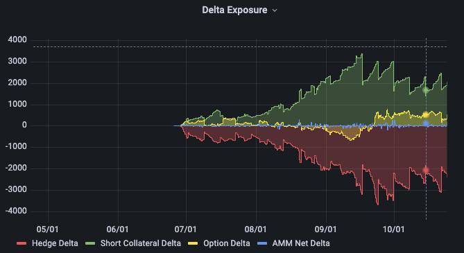

<!--You can leave these HTML comments in your merged LEAP and delete the visible duplicate text guides, they will not appear and may be helpful to refer to if you edit it again. This is the suggested template for new LEAPs. Note that a LEAP number will be assigned by an editor. When opening a p ull request to submit your LEAP, please use an abbreviated title in the filename, `leap-draft_title_abbrev.md`. The title should be 44 characters or less.-->

## Simple Summary

<!--"If you can't explain it simply, you don't understand it well enough." Simply describe the outcome the proposed changes intends to achieve. This should be non-technical and accessible to a casual community member.-->

Increase pool capital efficiency by allowing the AMM to partially cash collateralize its short positions. Spot risk is 
accounted for by extending delta hedging capacity of the pool. Newly introduced insolvency risk will be handled by contract adjustments for long traders.

## Abstract

<!--A short (~200 word) description of the proposed change, the abstract should clearly describe the proposed change. This is what *will* be done if the LEAP is implemented, not *why* it should be done or *how* it will be done. If the LEAP proposes deploying a new contract, write, "we propose to deploy a new contract that will do x".-->

This LEAP proposes substantial improvements in capital efficiency by removing the need for the AMM to lock one baseAsset (i.e. sETH) per 
call sold. To achieve this, the pool will instead hold a significant portion against the options in cash and all quoteAsset funds
held by the pool will be available for delta hedging. Notably, not being fully collateralized opens the pool to 
possible insolvency. To handle these black swan events, contract adjustments will be introduced which reduces long 
holder positions, allowing all long holders to get an equal share, and preventing the LP being emptied fully.

## Motivation

<!--This is the problem statement. This is the *why* of the LEAP. It should clearly explain *why* the current state of the protocol is inadequate.  It is critical that you explain *why* the change is needed, if the LEAP proposes changing how something is calculated, you must address *why* the current calculation is innaccurate or wrong. This is not the place to describe how the LEAP will address the issue!-->
### Improved pool capital efficiency

By removing the swap requirement for long calls, the amount of fees paid by the pool to collateralise these options is 
reduced drastically, and will enable more options to be sold overall by the pool. The lack of delta exposure for the 
baseAsset also means the size of the delta hedge will be drastically reduced.



Looking at the delta exposure over time on the ETH pool, it’s pretty clear that this change is generally a 10-20x improvement on the amount of fees paid. Historically, for the ETH market the peak absolute option delta was around the 12th Sept.

* Long call collateral exposure = 1422
* Net option delta = 500
* Meaning a short of 1922 needed to be opened to hedge this delta exposure

In this worst case (historically, for ETH), needing to hedge only 500 deltas compared to a total of 3300 is at least a ~6.6x improvement on the amount of fees paid by LPs. For the BTC market this improvement at worst is still ~2.2x on swap fees paid, on average still ~10x.

### Improved trading experience
This reduction in fees paid by LPs can also help traders by enabling the lowering of spreads.

### Increase modularity
Refactor how quoteAsset and baseAsset are handled in the contracts to support a larger variety of currencies in the future.


## Specification

<!--The specification should describe the syntax and semantics of any new feature, there are five sections
1. Overview
2. Rationale
3. Technical Specification
4. Test Cases
5. Configurable Values
-->

### Partially Cash Collateralized

<!--This is a high level overview of *how* the LEAP will solve the problem. The overview should clearly describe how the new feature will be implemented.-->

In the `LiquidityPool` contract, the `lockedCollateral` variable represents the net trader long exposure. `lockedCollateral.base` is the sum of all long calls, `lockedCollateral.quote` is the sum of all long puts multiplied by the individual option strikes.

Two new parameters will be introduced to the LiquidityPool to handle scaling the amount of collateral held by the LP. 
* `CallCollateralScalingFactor` - How much to scale cash held for calls sold by the AMM (e.g. 0.7)
* `PutCollateralScalingFactor` - How much to scale cash held for puts sold by the AMM (e.g. 0.8)

The amount of quoteAsset funds reserved by the AMM will be equal to `lockedCollateral.quote * PutCollateralScalingFactor + 
lockedCollateral.base * spotPrice * CallCollateralScalingFactor`. These funds will be available for the PoolHedger to use to
collateralise any hedges that it may make - which differs from the Avalon release, where there was clear separation of
option collateral and hedging liquidity.

Funds in the AMM are re-categorised in the following buckets: 
* `freeLiquidity` can be used for opening new positions (reserving funds for longs + paying shorters)
* `freeLiquidity + reservedCollatLiquidity` can be used for closing existing positions (long payouts)
* `freeLiquidity + reservedCollatLiquidity + pendingDeltaLiquidity` is all available for the hedger to use for hedging delta risk.

These changes to the priority of funds can be seen by the changes required to the `_getLiquidity` function.

```solidity
function _getLiquidity(
 uint basePrice, uint totalPoolValue, uint reservedTokenValue, uint usedDelta, uint pendingDelta
) internal view returns (Liquidity memory) {
 Liquidity memory liquidity;
 liquidity.NAV = totalPoolValue;
 liquidity.usedDeltaLiquidity = usedDelta;

 uint usedQuote = totalOutstandingSettlements + totalQueuedDeposits;
 uint totalQuote = quoteAsset.balanceOf(address(this));
 uint availableQuote = totalQuote > usedQuote ? totalQuote - usedQuote : 0;

 liquidity.pendingDeltaLiquidity = availableQuote > pendingDelta ? pendingDelta : availableQuote;
 availableQuote -= liquidity.pendingDeltaLiquidity;

 uint reservedCollatLiquidity = lockedCollateral.quote.multiplyDecimal(PutCollatScalingFactor) //
   + lockedCollateral.base.multiplyDecimal(basePrice).multiplyDecimal(CallCollatScalingFactor);
 liquidity.usedCollatLiquidity = availableQuote > reservedCollatLiquidity ? reservedCollatLiquidity : availableQuote;
 availableQuote -= liquidity.usedCollatLiquidity;

 liquidity.freeLiquidity = availableQuote > reservedTokenValue
   ? availableQuote - reservedTokenValue
   : 0;

 liquidity.burnableLiquidity = availableQuote;

 return liquidity;
}
```

### Contract Adjustments
The introduction of partial cash collateralization for options means that the pool is open to insolvencies when the 
`netOptionValue` exceeds the total asset value of the LP. A solution to this issue is by equally reducing all long
holder payouts/value by some percentage, while this issue remains.

Note, this is an extremely unlikely scenario given large cash buffers and constant delta hedging.

One new parameter will be introduced to the LiquidityPool, `AdjustmentNetValueScalingFactor`. This value will cap the total pool value to be counted towards scaling longs down.

For example, given:
* netAssetValue of 10,000
* AdjustmentNetValueScalingFactor of 0.9
* netOptionDebt of 9,500

The following can be computed:
* scaledNetValue = 10,000 * 0.9 = 9,000
* Because netOptionDebt > scaledNetValue
* longScaleFactor = 9000/9500 = 94%

Now whenever a long is closed or settled, the option value/settlement value will be scaled by this amount before funds are transferred to the user.

At the time of board expiry, this value is calculated and then stored for the board that was settled, so it is applied equally to all options that are settled for that board.

Note a quirk of this algorithm; as the netOptionDebt is equal to the value of longs minus the value of shorts, the scale factor can affect the value more than may be desired.

Using the example above, given:
* netOptionDebt = 49,500 in long debt and 40,000 owed to the amm in shorts (49500 - 40000 = 9500)
The long debt is the only part affected by the longScaleFactor, so now: netOptionDebt = 49500 * 0.94 - 40000 = 6530

So while the pool should have lost 9000 in value (as the factor is 90% of the 10k sized pool) - because the scaling is applied to all longs, the pool only loses 6530. However, this value is calculated atomically for every trade, so as the longs are closed, this scaling goes down.

Note, due to this quirk; a circuit breaker (`contractAdjustmentCBTimeout`) must be added to make sure deposits and withdrawals are frozen for the duration of any contract adjustment event.

### Covered Calls
Covered calls will still be supported. The `LiquidityPool` will still be able to handle any baseAsset balance it receives from ITM short settlement, as well as any funds received from liquidations. This balance will always be sold down to 0.

### PoolHedger changes
Due to the large reliance on the PoolHedger being used to mitigate delta risk, and additional call at the time of option purchasing will be done to ensure that the hedger is available to hedge the risk the user is introducing. Additionally, there will be a delta threshold (`deltaHedgeThreshold`) rather than just a simple time interval between hedges.

There will also be a function added to enable checking whether a position can be delta hedged when opened. This will prevent the opening of positions which increase the pool risk further, when it is unable to hedge. Closing at all times will still be supported. 


## Configurable Values
| Name                        | Value |
|-----------------------------|-------|
| adjustmentNetScalingFactor  | 0.9   |
| callCollatScalingFactor     | 0.7   |
| putCollatScalingFactor      | 0.8   |
| contractAdjustmentCBTimeout | 86400 |
| deltaHedgeThreshold         | 200   |


## Copyright

Copyright and related rights waived via [CC0](https://creativecommons.org/publicdomain/zero/1.0/).
